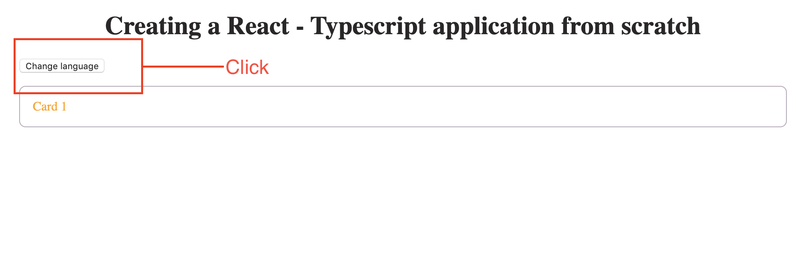

# react-typescript
This source code is a way i'm tracking myself trying out typescript.

## Technology included
1. React
2. Redux
3. Thunk
4. Typescript

## Running the app
1. Install the app `npm install`
2. Run the app `npm run start`  
It will be available at port `8080`

## Change the language
Just click on the button to change language  

